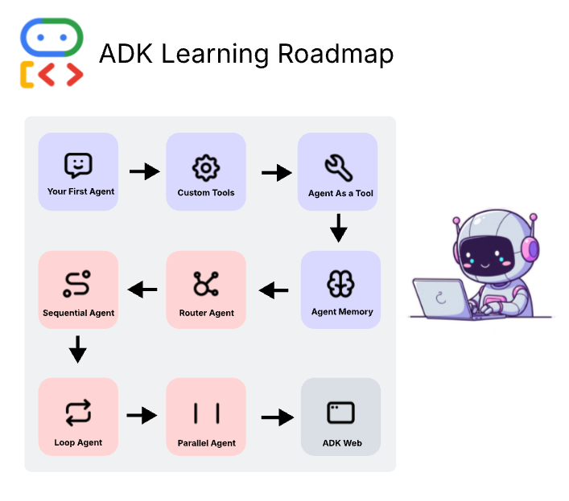

# DevFest 2025 Workshop - Agentic AI with Google ADK

This workshop teaches you how to build AI agents using Google's Agent Development Kit (ADK).



## Quick Setup

All workshop parts share the same API configuration:

```bash
# Copy the example file and add your API key
cp env.example .env
# Edit .env and replace 'your-api-key-here' with your actual Google API Key
```

Get your API key here: https://codelabs.developers.google.com/onramp/instructions#1

## Workshop Parts

- **P1-ToolCalling**: Your First Agent - The Day Trip Genie 🧞
  - Learn agent basics
  - Use built-in tools (Google Search)
  - Create budget-aware itineraries

- **P2-CustomTools**: Supercharging Agents with Custom Tools 🛠️
  - Create custom function tools
  - Integrate external APIs (Weather Service)
  - Use real-time data in recommendations

- **P3-AgentTeams**: Building Agent Teams - The Specialist Pattern 👥
  - Build multi-agent systems
  - Use Agent-as-a-Tool pattern
  - Delegate tasks to specialist agents

- **P4-Memory**: Agent with Memory - The Adaptive Planner 🗺️
  - Understand sessions and conversational memory
  - Build multi-day itineraries progressively
  - Adapt to user feedback across conversation turns

- **P5-RouterAgent**: Router Agent - Intelligent Delegation 🧠
  - Build a router that analyzes and classifies requests
  - Delegate to specialist agents automatically
  - Foundation for complex multi-agent systems

- **P6-SequentialAgents**: Sequential Workflows - Chaining Agents 🔗
  - Use SequentialAgent to chain agents together
  - Pass data between agents via shared state
  - Build multi-step workflows declaratively

- **P7-LoopAgents**: Iterative Refinement with LoopAgent 🔁
  - Use LoopAgent for iterative improvement
  - Build plan-critique-refine cycles
  - Handle constraints through iteration

- **P8-ParallelAgents**: Parallel Power with ParallelAgent ⚡
  - Run multiple agents simultaneously
  - Maximize efficiency with concurrent execution
  - Synthesize results from parallel tasks

- **P9-Deployment**: Deploying to Cloud Run ☁️
  - Deploy agents to production
  - Google Cloud Run setup
  - Scaling and monitoring

## Structure

```
DevFest25-WS/
├── .env                    # Shared API keys (create from env.example)
├── env.example             # Template for environment variables
├── P1-ToolCalling/         # Part 1: Basic agent with tools
├── P2-CustomTools/         # Part 2: Custom tools with external APIs
├── P3-AgentTeams/          # Part 3: Multi-agent systems
├── P4-Memory/              # Part 4: Sessions and memory
├── P5-RouterAgent/         # Part 5: Router agent and delegation
├── P6-SequentialAgents/    # Part 6: Sequential workflows
├── P7-LoopAgents/          # Part 7: Iterative refinement
├── P8-ParallelAgents/      # Part 8: Parallel execution
├── P9-Deployment/          # Part 9: Cloud deployment
└── source/                 # Original workshop notebooks
```

**Note:** This workshop code is inspired by and adapted from the notebooks in the `source/` folder.
